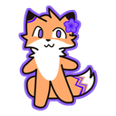
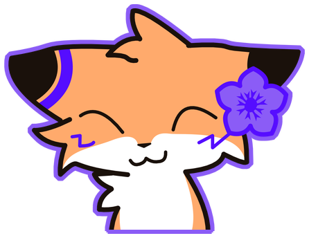

<div align="center">



# claude-rus-hub

**Русификаторы для игр, собранные вместе с нейросетью Claude.**

[Каталог переводов](https://e24x5-Fox.github.io/claude-rus-hub/) ·
[Скачать](https://github.com/e24x5-Fox/claude-rus-hub/releases) ·
[Сообщить об ошибке](https://github.com/e24x5-Fox/claude-rus-hub/issues)

[](https://github.com/e24x5-Fox/claude-rus-hub/releases/latest)
[](https://github.com/e24x5-Fox/claude-rus-hub/releases)

</div>

---

## Переводы

| Игра | Состояние | Что переведено | Скачать |
|---|---|---|---|
| **Drag'n Wash** <br><sub>Unity · 18+</sub> | ✅ готово, v1.0 | диалоги (1839 реплик), интерфейс (89 строк), меню настроек (36 подписей), 87 текстур | [установщик](https://github.com/e24x5-Fox/claude-rus-hub/releases/latest) |
| **Amorous** <br><sub>FNA/MonoGame · 18+</sub> | 🛠 в работе | 13 142 реплики, 276 579 слов; надписи интерфейса вшиты в картинки | — |

Список на сайте строится из [`docs/games.js`](docs/games.js) — новая игра
добавляется одной записью, разметку страницы править не нужно.

## Установка

1. **Закройте игру.** Установщик правит её файлы.
2. Скачайте `.exe` со страницы релиза и запустите.
3. Путь к игре искать не нужно — установщик сам находит её по библиотекам Steam.
   Проверьте путь и нажмите **Установить**.
4. Вернуть оригинал: тот же установщик, кнопка **Удалить**.

Есть консольный режим — на случай, если игра стоит вне Steam:

```
<Имя>-RU-Setup.exe --install [путь к папке игры]
<Имя>-RU-Setup.exe --uninstall [путь к папке игры]
```

> **Windows SmartScreen.** Установщик не подписан цифровой подписью, поэтому
> система предупреждает о незнакомом файле. «Подробнее» → «Выполнить в любом случае».

## Как устроены эти русификаторы

Это не подмена файлов целиком, а точечная правка ресурсов игры:

- **диалоги** — таблица строк внутри игрового ресурса разбирается и собирается обратно;
  сборка проверена на побайтовое совпадение с оригиналом;
- **интерфейс** — строки заменяются по заранее найденным смещениям, и перед каждой
  заменой установщик сверяет, что по адресу лежит ожидаемый английский текст;
- **текстуры** — перерисованные картинки кодируются в тот же формат и размер,
  поэтому переписываются на месте, а многосотмегабайтные файлы не копируются.

Перед любой правкой создаётся резервная копия рядом с файлами игры; кнопка
**Удалить** возвращает всё на место и стирает копии.

## Что здесь лежит

```
docs/              сайт-каталог (GitHub Pages)
  index.html       страница
  games.js         данные каталога — сюда добавляются игры
  site.css         стили поверх токенов бренда
  tokens.css       палитра и метрики (копия из мастерской)
  assets/          баннеры игр и картинки
README.md          этот файл
```

Мастерская, в которой переводы собираются, — отдельный проект: там лежат
движок распаковки, инструменты перерисовки текстур и сборщик установщика.
Здесь публикуются только готовые сборки.

## Обратная связь

Нашли непереведённую фразу, опечатку, кривую текстуру или вылет — напишите
в [Issues](https://github.com/e24x5-Fox/claude-rus-hub/issues). Полезно указать
игру, момент в игре и приложить скриншот.

## Переводы делает нейросеть

Тексты переводит Claude, человек проверяет результат в игре. Литературной
безупречности каждой строки это не гарантирует — зато перевод выходит целиком
и быстро, а не «когда-нибудь». Замечания принимаются и идут в следующую версию.

<div align="center"></div>
